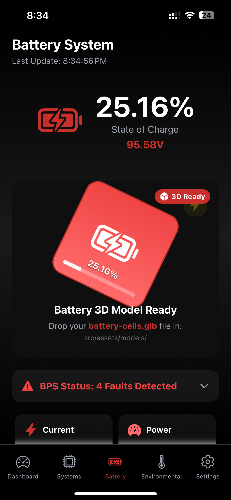
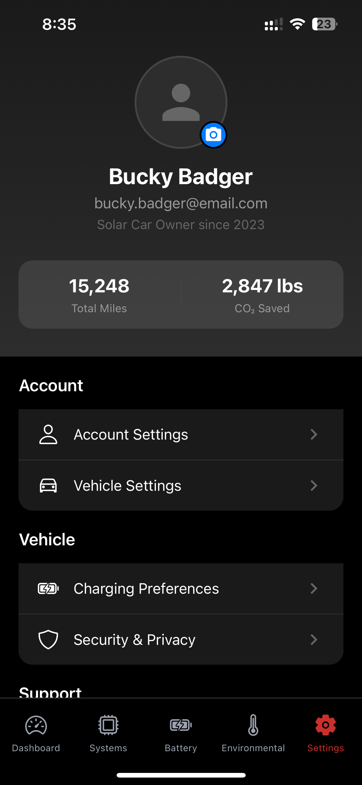

# BSR Solar Car 2 - Mobile Telemetry App

This is a React Native/Expo based mobile application for real-time telemetry monitoring of our Solar Car 2 (SC2). It will provide live visualization of vehicle subsystems by integrating 3D models, battery status, environmental conditions, and safety alerts. It will serve as a mobile alternative to the engineering (chase car) dashboard for those who prefer the smaller form factor.

## Screenshots

| Dashboard | Systems | Battery |
|-----------|---------|---------|
|  |  |  |

| Environmental | Settings |
|---------------|----------|
|  |  |

## Quick Start

### Prerequisites
- Node.js (v18.x or v20.x)
- Expo Go app on your mobile device (for both iOS and Android)

### Installation & Running
1.  **Clone the repository:**
    ```bash
    git clone https://github.com/badgerloop-software/sc2-mobile-app.git
    cd sc2-mobile-app
    ```

2.  **Install dependencies:**
    ```bash
    npm install
    ```

3.  **Start the development server:**
    ```bash
    npx expo start
    ```

4.  **Run the app:**
    - Scan the QR code displayed in the terminal with Expo Go (Android) or the Camera app (iOS)

## Tech Stack

- **Framework:** React Native
- **Platform:** Expo (SDK 53)
- **Navigation:** React Navigation
- **UI:** Expo Linear Gradient, Expo Blur
- **Icons:** Expo Vector Icons
- **Animation:** React Native Reanimated

## Project Structure

```
sc2-mobile-app/
├── .github/        # GitHub Actions (CI/CD)
├── assets/         # Images and icons
├── docs/           # Project documentation
├── src/            # Source code
│   ├── assets/     # Models and other assets
│   ├── components/ # Reusable components
│   ├── data/       # Mock data and data sources
│   ├── screens/    # Application screens
│   └── utils/      # Utility functions
├── App.js          # Main application component
└── package.json    # Project dependencies
```