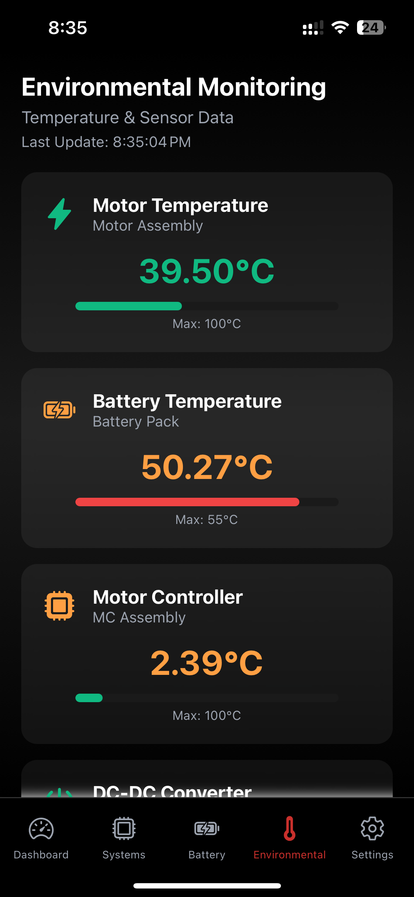

# BSR Solar Car 2 - Mobile Telemetry App

[](https://github.com/BadgerSolarRacing/sc2-mobile-app/actions)
[](https://github.com/BadgerSolarRacing/sc2-mobile-app/actions)

## Project Goals

One of the primary goals of the software team is to provide the rest of the team (primarily electrical) with the information they need to monitor the car's performance and troubleshoot issues. We have already built a chase car dashboard for this purpose, but after visiting competition, we recognize that not everyone prefers the laptop form factor for viewing the live status of their subsystem.

Mobile might be a form factor that more team members will adopt, especially those who do not need to save drive recordings or view the status of our strategy simulations. This mobile app serves as a concept frontend that we can start with as a team to explore mobile telemetry monitoring.

This is a (unfinished!) React Native/Expo mobile application for real-time telemetry monitoring of Badger Solar Racing's Solar Car 2 (SC2). Built for iOS devices with Expo Go support in mind but compatible soon with other platforms, this application helps in providing live visualization of vehicle subsystems, battery status, environmental conditions, and safety alerts.

The app is designed to support animatable 3D models, including detailed models of the battery pack and the solar car itself, ideally to provide a more immersive way to visualize vehicle components and their real-time status.

## Features

- Live Telemetry Dashboard: Real-time vehicle data visualization
- Battery System Monitoring: SOC, voltage, current, temperature, and BPS fault detection
- Solar Array Tracking: MPPT monitoring and power generation metrics
- Environmental Monitoring: Temperature sensors, weather integration, and location tracking
- Safety Alerts: Critical system warnings and fault detection
- 3D Visualizations: Ready for solar car and battery pack 3D models
- Systems Overview: Detailed signal monitoring with health scoring

## Screenshots

| Dashboard | Systems | Battery |
|-----------|---------|---------|
|  |  |  |
| **Dashboard (1/5)** | **Systems (2/5)** | **Battery (3/5)** |
| Main telemetry overview with key metrics and alerts | Detailed system telemetry and signal monitoring | Battery pack monitoring with cell voltages and health status |

| Environmental | Settings |
|---------------|----------|
|  |  |
| **Environmental (4/5)** | **Settings (5/5)** |
| Environmental data, weather, and location tracking | User preferences and configuration options |

## Quick Start

### Prerequisites
- Node.js (18.x or 20.x)
- Expo CLI
- iOS device with Expo Go app (or Android device for cross-platform testing)

### Installation
```bash
# Clone the repository
git clone https://github.com/BadgerSolarRacing/sc2-mobile-app.git
cd sc2-mobile-app

# Install dependencies
npm install

# Start the development server
npx expo start
```

### Running the App
1. Start the Expo development server: `npx expo start`
2. Open Expo Go on your iOS device
3. Scan the QR code displayed in the terminal
4. The app will load and display live telemetry data

## Tech Stack

- **React Native** - Mobile app framework
- **Expo SDK 53** - Development platform
- **React Navigation** - Navigation system
- **Expo Linear Gradient** - UI gradients
- **React Native Reanimated** - Smooth animations
- **Expo Blur** - Glass-morphism effects
- **Expo Vector Icons** - Icon library

## Project Structure

```
sc2-mobile-app/
├── docs/                           # Documentation
│   ├── 3D-MODEL-WORKFLOW.md       # 3D model integration guide
│   ├── 3d-models-guide.md         # 3D models setup
│   ├── github-actions-setup.md    # CI/CD configuration
│   └── copilot-instructions.md    # Development guidelines
├── src/
│   ├── screens/                    # App screens
│   │   ├── HomeScreen.js           # Main dashboard
│   │   ├── BatteryScreen.js        # Battery monitoring
│   │   ├── SystemsScreen.js        # System telemetry
│   │   └── EnvironmentalScreen.js  # Environmental data
│   ├── components/                 # Reusable components
│   │   ├── SolarCar3DViewer.js     # 3D car visualization
│   │   ├── Battery3DViewer.js      # 3D battery visualization
│   │   ├── LocationWeatherDisplay.js
│   │   └── MapView.js
│   ├── data/
│   │   └── telemetryData.js        # Mock telemetry data
│   └── assets/
│       └── models/                 # 3D model files
├── .github/workflows/              # GitHub Actions CI/CD
├── App.js                          # Main app component
├── package.json
└── app.json
```

## Documentation

All documentation is organized in the `docs/` folder:

- **[3D Model Integration](docs/3D-MODEL-WORKFLOW.md)** - Complete guide for adding 3D models
- **[3D Models Setup](docs/3d-models-guide.md)** - GLB file specifications and setup
- **[GitHub Actions Setup](docs/github-actions-setup.md)** - CI/CD configuration
- **[Development Guidelines](docs/copilot-instructions.md)** - Coding standards and practices

## Development

### Adding 3D Models
1. Export your model as GLB format (< 5MB, < 10k triangles)
2. Place in `src/assets/models/`
3. Name files: `solar-car.glb` or `battery-cells.glb`
4. Models will automatically be detected and loaded

### Telemetry Data
The app currently uses mock telemetry data from `src/data/telemetryData.js`. To connect to real CAN bus data:
1. Replace mock data generator with real data source
2. Update signal definitions in telemetryData.js
3. Maintain the same data structure for compatibility

**Note:** We may need to make changes to our backend systems to properly support this mobile app, including potential modifications to data streaming protocols, API endpoints, or real-time communication channels to ensure optimal mobile performance and battery efficiency.

### Testing
```bash
# Run build check
npm ci
npx expo-doctor
npx expo export --platform all --dev

# Check for issues
npx expo start --no-dev --minify
```

## Deployment

### Development Builds
```bash
# iOS Simulator
npx expo build:ios --type simulator

# Android APK
npx expo build:android --type apk
```

### Production Builds (EAS)
```bash
# Setup EAS
npm install -g eas-cli
eas login

# Build for production
eas build --platform ios --profile production
eas build --platform android --profile production
```

## Contributing

1. Fork the repository
2. Create a feature branch: `git checkout -b feature/amazing-feature`
3. Commit your changes: `git commit -m 'Add amazing feature'`
4. Push to branch: `git push origin feature/amazing-feature`
5. Open a Pull Request

### Development Guidelines
- Follow the coding standards in `docs/copilot-instructions.md`
- Test on real iOS devices using Expo Go
- Ensure all CI/CD checks pass
- Add documentation for new features

## CI/CD

This project uses GitHub Actions for automated testing and building:

- **Build Check**: Validates code and dependencies on every push
- **EAS Build**: Creates production-ready app builds
- **Security Scanning**: Checks for vulnerabilities
- **Bundle Size Monitoring**: Warns about large bundles

See `docs/github-actions-setup.md` for configuration details.

## Badger Solar Racing

This app is part of Badger Solar Racing's Solar Car 2 project. For more information about the team and vehicle:

- **Website**: [Badger Solar Racing](https://badgersolarracing.com)
- **GitHub**: [BadgerSolarRacing](https://github.com/BadgerSolarRacing)

## License

This project is licensed under the MIT License - see the [LICENSE](LICENSE) file for details.

## Future Enhancements

- Real CAN bus integration
- Historical data logging
- Predictive maintenance alerts
- Route optimization for solar efficiency
- Remote monitoring capabilities
- Data export functionality
- Advanced 3D visualizations
- Machine learning for fault prediction

---